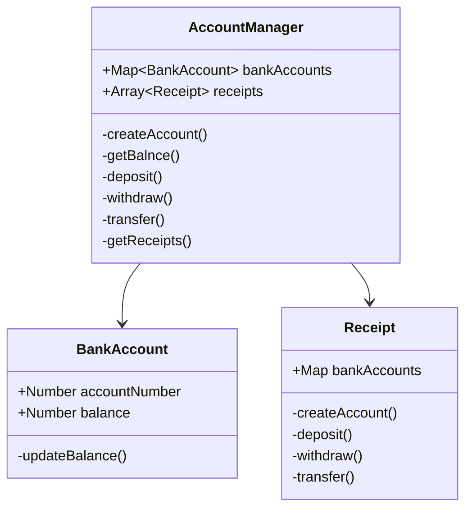

```mermaid
    classDiagram
        AccountManager -->BankAccount
        AccountManager -->Receipt

        class BankAccount {
        +Number accountNumber
        +Number balance
        -updateBalance()
        }

        class Receipt {
        +Map bankAccounts
        -createAccount()
        -deposit()
        -withdraw()
        -transfer()
        }

        class AccountManager {
        +Map~BankAccount~ bankAccounts
        +Array~Receipt~ receipts
        -createAccount()
        -getBalnce()
        -deposit()
        -withdraw()
        -transfer()
        -getReceipts()
        }
```